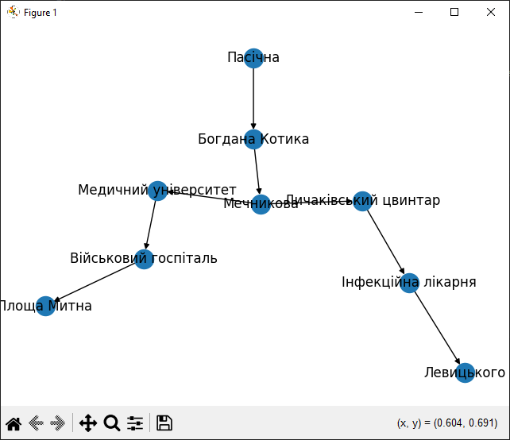

## Завдання 1
В ході роботи я підготував граф трамвайної мережі міста Львів.

Кількість ребер лише на кілька одиниць переважає кількість вершин, адже більшість зупинок (вершин) з'єднані (ребрами) переважно лише з двома суміжними зупинками, крім деяких центральних зупинок, в яких сходиться кілька маршрутів.

Ступінь близькості вузлів показує, які зупинки формують коло навколо центру (з більшою близькістю), а які відходять в віддалені райони міста (з меншою близькістю).  
Так, зупинка Вернадського (кінцева трамваю на спальний район Сихів) має найменшу близькість до інших вузлів, а зупинка Підвальна (центр міста), через яку проходить багато маршрутів, має найбільшу близькість.

## Завдання 2
Для завдання 2 я реалізував алгоритми DFS і BFS для знаходження шляхів у графі, створеному в завданні 1.

Розглянемо спрощений приклад проходження по графу від зупинки Пасічна з максимальною глибиною 5.  

Перші 2 кроки одинакові, адже Пасічна-Котика-Мечникова — це єдиний шлях. Далі алгоритми розходяться.

DFS йде в глибину, а саме до зупинки Медичний університет, а від неї до наступних зупинок у цій частині дерева — Військовий госпіталь і Площа Митна, де він досягає максимальної глибини 5 і повертається до зупинки Мечникова, звідки рухається по іншій частині дерева до Личаківського цвинтаря, а звідти до Інфекційної лікарні, і нарешті до Левицького.

BFS ж від Мечникова рухається до обох суміжних зупинок Медичний університет і Личаківський цвинтар, тоді до їх суміжних — Військовий госпіталь і Інфекційна лікарня, і аж тоді до зупинок з максимальною глибиною 5 — Площа Митна і Левицького.

## Завдання 3
Для завдання 3 я реалізував алгоритми Дейкстри для знаходження найкоротшого шляху в розробленому графі між всіма ребрами.